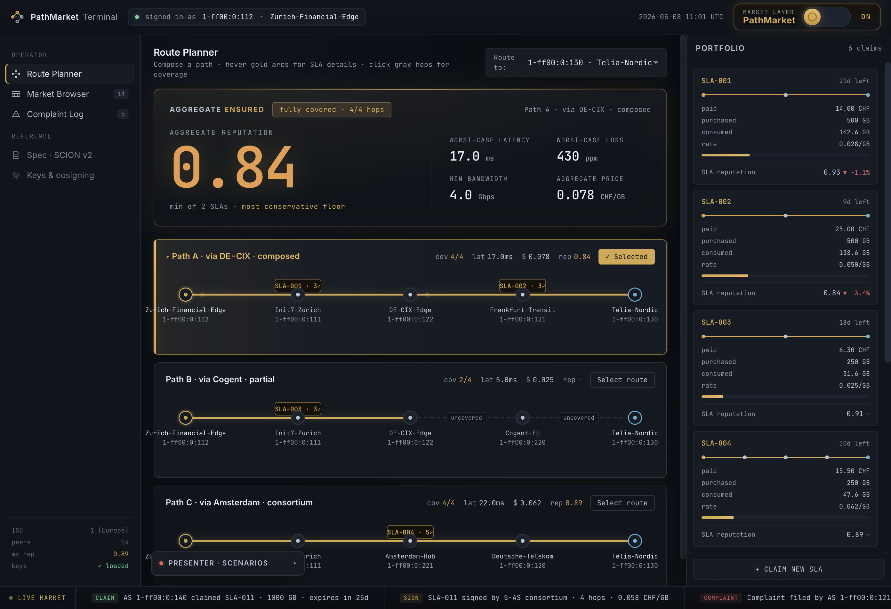

# PathMarket

A market-and-reputation overlay for [SCION](https://scion.org/) transit, operating
entirely above the dataplane. Three local Python processes turn configured
SCION-style AS identities into economic actors that publish signed transit
guarantees, claim coverage as buyers, file signed complaints when guarantees
are violated, and watch reputation rise or fall based on k-corroborated
complaints.

<p align="center">
  
</p>

> For the implementation-level tour — schemas, validation chains, scorer
> mechanics, agent loop, UI wiring, and the limits of the prototype — see
> **[WALKTHROUGH.md](WALKTHROUGH.md)**. This README is just the orientation.

---

## What it does

SCION makes path choice explicit, but the routing decision is still hard to
operate: which path is trustworthy, what quality was promised, who stands
behind each hop, and what recourse exists when the path underperforms?

PathMarket is one answer:

1. Transit ASes co-sign **SLAs** offering bounds (latency / loss / bandwidth)
   over a path segment, at a price per GB.
2. Buyers **claim** coverage on those SLAs.
3. Anyone who used a covered path can file a signed **complaint** if the bound
   was violated.
4. A **scorer** turns k-corroborated complaints into per-AS reputation.
5. An **operator terminal** renders all of this on top of candidate SCION
   paths so a human can compose, inspect, and select routes.

The narrow demo claim: the market visibly stratifies under k-corroborated
complaints, and the operator UI exposes that stratification as route-selection
signal. Everything not directly required for that — settlement, traffic
accounting, autonomous routing, TRC-rooted trust — is explicitly out of scope
(see [WALKTHROUGH.md §1](WALKTHROUGH.md) and §10).

## Architecture at a glance

Three cooperating local processes plus a shared library:

| Process | URL | Persists state | Source |
| --- | --- | --- | --- |
| Aggregator | `http://127.0.0.1:8080` | No (in-memory) | [src/pathmarket/aggregator/](src/pathmarket/aggregator/) |
| Simulator | `http://127.0.0.1:8081` (scenario API) | No | [src/pathmarket/simulator/](src/pathmarket/simulator/) |
| User agent + UI | `http://127.0.0.1:8090` | Yes (`runtime/user_as_state.json`) | [src/pathmarket/user_agent/](src/pathmarket/user_agent/) |

The simulator drives ~13 autonomous AS agents on top of either a static path
table or live `scion showpaths` output; the user agent runs the same `Agent`
class for one operator-controlled AS and serves the terminal UI from
[ui-export/](ui-export/).

Shared modules — schemas, canonical hashing, Ed25519 verification, the scorer,
the agent class, path discovery, the aggregator client — live under
[src/pathmarket/](src/pathmarket/) and are documented in
[WALKTHROUGH.md §2](WALKTHROUGH.md).

## Quick start

Requirements: Python 3.11+, `pip`. Optional: a local SCION checkout for live
path discovery.

```bash
python3 -m venv .venv
source .venv/bin/activate
pip install -e ".[dev]"

# Generate per-clone Ed25519 keys + the verifier keyring (gitignored).
python scripts/generate_keys.py \
  1-ff00:0:111 1-ff00:0:112 1-ff00:0:120 1-ff00:0:121 \
  1-ff00:0:122 1-ff00:0:130 1-ff00:0:131 1-ff00:0:132 \
  1-ff00:0:133 2-ff00:0:210 2-ff00:0:211 2-ff00:0:220 \
  2-ff00:0:221
python scripts/generate_keyring.py

make fast       # non-SCION test suite
make demo       # static-path demo at http://127.0.0.1:8090
```

For the live-SCION variant, point `SCION_ROOT` at a built SCION checkout with
the topology booted and run `make demo-scion`. If `gen/sciond_addresses.json`
is missing, path discovery falls back to the static table so the demo stays
usable.

## Useful targets

| Command | Description |
| --- | --- |
| `make install` | Editable install with dev tools |
| `make fast` | `pytest -m 'not end_to_end and not requires_scion'` |
| `make full` | All non-SCION tests |
| `make scion` | Tests marked `requires_scion` (needs a live topology) |
| `make demo` | Aggregator + simulator + user agent on static paths |
| `make demo-split` | Print the three commands for separate panes |
| `make demo-scion` | Same demo using live `scion showpaths` |
| `make lint` | Ruff over `src`, `tests`, `scripts` |
| `make type` | mypy over `src` |

## Repository layout

```text
src/pathmarket/
  schemas.py           Frozen dataclasses for all signed payloads + envelopes
  canonical.py         Canonical JSON + content-hash IDs
  verifier/            Static-keyring Ed25519 verifier
  scorer/              k-corroboration + EWMA scoring (stateless)
  agent/               Shared Agent class, policy evaluation, simulated quality
  path_discovery/      Pluggable static-table + scion-showpaths backends
  aggregator/          FastAPI service: validation chains, storage, queries
  simulator/           Tick loop, scenarios, cold-start recorder
  user_agent/          Local state, candidate-route enumeration, UI API
  client.py            httpx-based aggregator client

ui-export/             Operator terminal (static assets, wired in data.js)
assets/                Cold-start replay artifact (cold_start.jsonl)
scion-topology/        Static path table fallback
scripts/               Demo-key, keyring, and replay helpers
tests/                 24 test files, pytest-driven
```

Generated material — `keys/`, `keyring.json`, `runtime/user_as_state.json`,
caches, virtualenvs — is gitignored and regenerated per clone.

## Status & non-goals

This is a research/demo prototype, not a production system. The cryptographic
core (signed SLAs, k-corroboration, EWMA scoring, static-keyring trust) is
real; everything else above the dataplane is deliberately scoped narrow.

Not included, and explicitly so:

- No SCION dataplane modification (zero Go).
- No real traffic forwarding — quality is sampled from a probabilistic model.
- No autonomous reputation-gated routing in the simulator (the
  reputation-to-route link exists only as a UI affordance).
- No defence against fabricated measurements or k-AS collusion.
- No TRC-rooted trust — the static keyring is the trust root.
- No persistent aggregator/simulator state across restarts.

[WALKTHROUGH.md §10](WALKTHROUGH.md) lists the limits in full.
